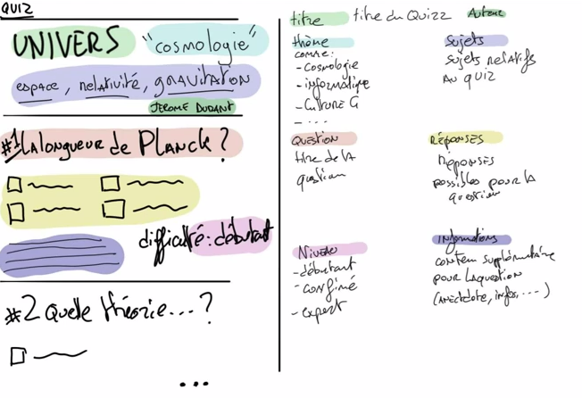
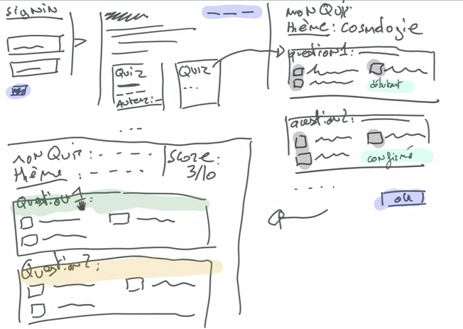

# Projet oQuiz

Un client est venu nous voir pour nous demander de lui créer un site qui fait des quizzes ! Apparemment c'est quelqu'un d'important car il connait Elon Musk, houlala !

Voici ce qu'il nous a demandé :

Nous avons commencé a définir les besoins sous forme de uses cases disponibles [ici](uses_cases.md)
